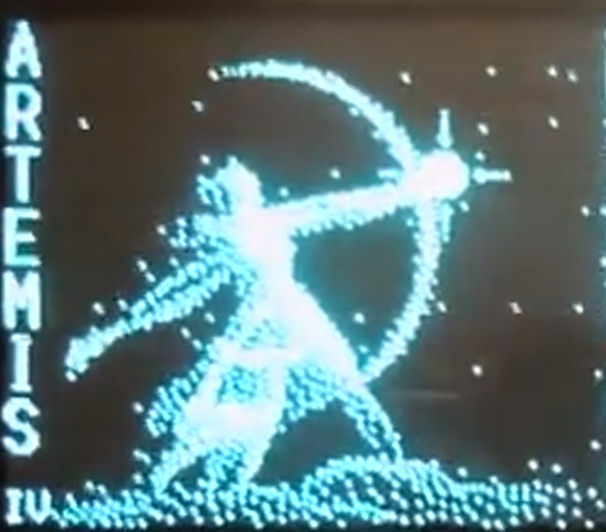
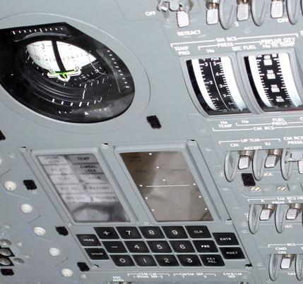

<!-- PROJECT LOGO -->
 

  

<h3 align="center">artemis</h3>

  

    An Apollo program inspired Jeep CJ-5 build
     
     
    <a href="https://github.com/zenmetsu/artemis"><strong>Explore the docs »</strong></a>
     
     
    <a href="https://github.com/zenmetsu/artemis">View Demo</a>
    ·
    <a href="https://github.com/zenmetsu/artemis/issues">Report Bug</a>
    ·
    <a href="https://github.com/zenmetsu/artemis/issues">Request Feature</a>
  

<!-- TABLE OF CONTENTS -->

  
Table of Contents

  <ol>
    <li>
      <a href="#about-the-project">About The Project</a>
      <ul>
        <li><a href="#built-with">Built With</a></li>
      </ul>
    </li>
    <li><a href="#roadmap">Roadmap</a></li>
    <li><a href="#contributing">Contributing</a></li>
    <li><a href="#license">License</a></li>
    <li><a href="#contact">Contact</a></li>
    <li><a href="#acknowledgments">Acknowledgments</a></li>
  </ol>

<!-- ABOUT THE PROJECT -->
## About The Project
  

This project will encompass the transformation of my 1965 CJ-5 to something unique from the period.  In deciding upon a new dashboard layout, I wanted to do something unusual which would showcase the many skills that I have learned over a lifetime of tinkering and creating.  I have long had a fascination with the great space race, and I felt that an aerospace aesthetic would suit this vehicle well.  As such, I have decided to theme my dashboard in a manner reminiscent of the control consoles of the Apollo program.  

## Instrumentation
This project will require me to build many of my own custom gauges:  

#### FDAI
I plan on building my own flight director attitude indicator (FDAI).  

#### DSKY
I will need to build a custom DiSplay/KeYboard (DSKY) unit.  I am well aware of the opensource DSKY unit, but the cost of the unit cannot be justified, especially considering that my DSKY will need to control many vehicle functions via GPIO which would require significant modifications to the opensource model.  I am unhappy with the looks of using 7-segment LED units, so I would prefer to homebrew something to give the high contrast and crisp display of the original electroluminescent modules.  I will attempt to follow the excellent project that <a href="https://www.youtube.com/@AppliedScience">Applied Science</a> posted on youtube here:

(<a href="#readme-top">back to top</a>)

### Built With

* [![C++][-C++]][-C++-url]

(<a href="#readme-top">back to top</a>)

<!-- ROADMAP -->
## Roadmap

- [ ] repaint Jeep body
    - [x] [select paint to match original tone](log/paint/readme.md)
- [ ] build dashboard
    - [ ] build custom gauges
        - [ ] linear style vertical gauges
        - [ ] FDAI
        - [ ] DSKY
    - [ ] decide upon layout
    - [ ] have custom dash panel fabricated
    - [ ] integrate gauges
- [ ] program DSKY
- [ ] expand DSKY functionality
    - [ ] navigation
    - [ ] amateur radio interface
        - [ ] APRS integration
        - [ ] js8call integration

See the [open issues](https://github.com/zenmetsu/artemis/issues) for a full list of proposed features (and known issues).

(<a href="#readme-top">back to top</a>)

<!-- CONTRIBUTING -->
## Contributing

Contributions are welcome.  I have many challenges ahead of me, but I do have ideas on how to tackle some of the problems in a novel manner.  I would love to shortcut the designing of the gauges... if functional replicas of the FDAI or other instrumentation exist, I would enjoy hearing about it so I don't have to reinvent the wheel, so to speak.

(<a href="#readme-top">back to top</a>)

<!-- LICENSE -->
## License

Distributed under the MIT License. See `LICENSE.txt` for more information.

(<a href="#readme-top">back to top</a>)

<!-- CONTACT -->
## Contact

Arrow Westervelt - arrow.westervelt@protonmail.com

Project Link: [https://github.com/zenmetsu/artemis](https://github.com/zenmetsu/artemis)

(<a href="#readme-top">back to top</a>)

<!-- ACKNOWLEDGMENTS -->
## Acknowledgments

coming soon... maybe if i get hardware donations or folks willing to sell me flight hardware they can wind up here.  :')
* 
* 
* 

(<a href="#readme-top">back to top</a>)

<!-- MARKDOWN LINKS & IMAGES -->
<!-- https://www.markdownguide.org/basic-syntax/#reference-style-links -->
[contributors-shield]: https://img.shields.io/github/contributors/github_username/repo_name.svg?style=for-the-badge
[contributors-url]: https://github.com/github_username/repo_name/graphs/contributors
[forks-shield]: https://img.shields.io/github/forks/github_username/repo_name.svg?style=for-the-badge
[forks-url]: https://github.com/github_username/repo_name/network/members
[stars-shield]: https://img.shields.io/github/stars/github_username/repo_name.svg?style=for-the-badge
[stars-url]: https://github.com/github_username/repo_name/stargazers
[issues-shield]: https://img.shields.io/github/issues/github_username/repo_name.svg?style=for-the-badge
[issues-url]: https://github.com/github_username/repo_name/issues
[license-shield]: https://img.shields.io/github/license/github_username/repo_name.svg?style=for-the-badge
[license-url]: https://github.com/github_username/repo_name/blob/master/LICENSE.txt
[linkedin-shield]: https://img.shields.io/badge/-LinkedIn-black.svg?style=for-the-badge&logo=linkedin&colorB=555
[linkedin-url]: https://linkedin.com/in/linkedin_username
[product-screenshot]: images/screenshot.png
[Next.js]: https://img.shields.io/badge/next.js-000000?style=for-the-badge&logo=nextdotjs&logoColor=white
[Next-url]: https://nextjs.org/
[React.js]: https://img.shields.io/badge/React-20232A?style=for-the-badge&logo=react&logoColor=61DAFB
[React-url]: https://reactjs.org/
[Vue.js]: https://img.shields.io/badge/Vue.js-35495E?style=for-the-badge&logo=vuedotjs&logoColor=4FC08D
[Vue-url]: https://vuejs.org/
[Angular.io]: https://img.shields.io/badge/Angular-DD0031?style=for-the-badge&logo=angular&logoColor=white
[Angular-url]: https://angular.io/
[Svelte.dev]: https://img.shields.io/badge/Svelte-4A4A55?style=for-the-badge&logo=svelte&logoColor=FF3E00
[Svelte-url]: https://svelte.dev/
[Laravel.com]: https://img.shields.io/badge/Laravel-FF2D20?style=for-the-badge&logo=laravel&logoColor=white
[Laravel-url]: https://laravel.com
[Bootstrap.com]: https://img.shields.io/badge/Bootstrap-563D7C?style=for-the-badge&logo=bootstrap&logoColor=white
[Bootstrap-url]: https://getbootstrap.com
[-C++]: https://img.shields.io/badge/-c++-black?logo=c%2B%2B&style=social
[-C++-url]: https://isocpp.org
[JQuery.com]: https://img.shields.io/badge/jQuery-0769AD?style=for-the-badge&logo=jquery&logoColor=white
[JQuery-url]: https://jquery.com 
[AppSci]: https://yt3.ggpht.com/ytc/AMLnZu_Yqmn0KqBrnuOqNmBmuik57gD2n1T-TfxqAhNa=s176-c-k-c0x00ffffff-no-rj
[AppSci-url]: https://www.youtube.com/@AppliedScience
